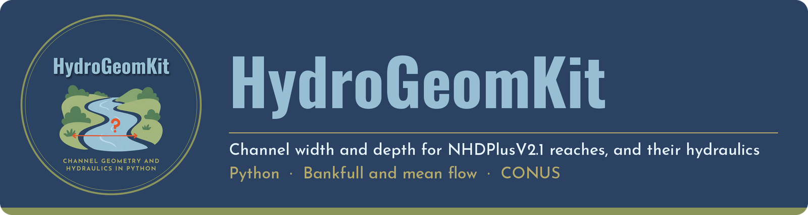
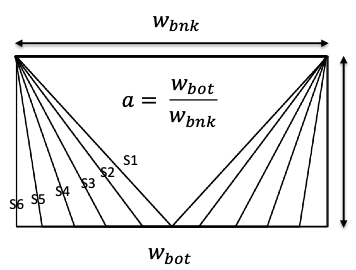
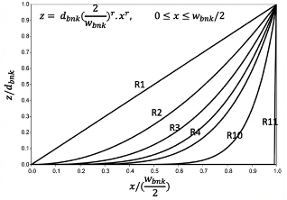
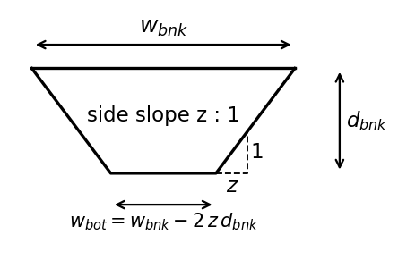

# HydroGeomKit

**HydroGeomKit** (`hydrogeomkit`) is a small Python package to get machine-learning estimates of **bankfull and
mean-flow channel width and depth** for NHDPlusV2.1 reaches and USGS gages across
the conterminous United States, straight into pandas or GeoPandas.

It uses [HydroGeomAPI](https://github.com/Reizrb/HydroGeomAPI) (live at
https://conus-channel-geometry.onrender.com), so there's nothing to download or
unzip first.

## Install

```bash
pip install "git+https://github.com/Reizrb/HydroGeomKit"
```

To get reach lines and gage points as a GeoDataFrame, also install GeoPandas:

```bash
pip install geopandas
```

## Use

```python
from hydrogeomkit import get_channel_geometry

# All reaches in a HUC8 watershed, as a pandas table
reaches = get_channel_geometry(huc8="03160112")

# Specific reaches by COMID
reaches = get_channel_geometry(comids=[18223451, 721640])

# A whole state or HUC2 region (values only, up to 500,000 reaches)
alabama = get_channel_geometry(state="AL")

# USGS gages, by site number (as text, to keep leading zeros)
gages = get_channel_geometry(site_nos=["02465000", "01206900"])

# Gages in a state, with their points, as a GeoDataFrame
gages = get_channel_geometry(dataset="gage", state="AL", geometry=True)

# Reaches inside your own study area (a shapely geometry, or a GeoDataFrame in any CRS)
import geopandas as gpd
basin = gpd.read_file("my_basin.shp")
reaches = get_channel_geometry(polygon=basin, geometry=True)
```

Choose **one** way to select the area: `comids`, `site_nos`, `state`, `huc2`,
`huc8`, `polygon`, or `conus=True` (gages only).

## What you get

| Column      | Description     | Units |
|-------------|-----------------|-------|
| `bnk_width` | Bankfull width  | m     |
| `bnk_depth` | Bankfull depth  | m     |
| `mf_width`  | Mean-flow width | m     |
| `mf_depth`  | Mean-flow depth | m     |

Reaches also have `comid`, `reachcode`, `state`, `huc2`, `huc8`, `stream_order`,
and `tot_da_sqkm` (total drainage area, km²). Gages also have `site_no`,
`station_nm`, `comid`, `reachcode`, `state`, `huc2`, `huc8`, `da_sqkm`, `lat`, and
`lon`. Codes (HUCs, reach codes, site numbers) are kept as text, so leading zeros
are preserved. Records without a prediction have empty (NaN) width and depth.

| `geometry=`     | Returns                              | Records per call |
|-----------------|--------------------------------------|------------------|
| `False` (default) | pandas DataFrame, values only      | up to 500,000    |
| `True`          | GeoDataFrame with lines or points (EPSG:4269) | up to 50,000 |

For all 2.7 million reaches, download the full dataset from
[Zenodo](https://doi.org/10.5281/zenodo.19208847).

## Compute hydraulic geometry

Three functions compute the cross-section geometry of a channel from its top width
and depth, for a chosen channel shape:

| Function | Returns | Units |
|----------|---------|-------|
| `xsec_area` | Cross-sectional area | m² |
| `wetted_perimeter` | Wetted perimeter | m |
| `hydraulic_radius` | Hydraulic radius (area / wetted perimeter) | m |

```python
from hydrogeomkit import get_channel_geometry, xsec_area, wetted_perimeter, hydraulic_radius

df = get_channel_geometry(huc8="03160112")

# Dingman's r (bank curvature)
df["bnk_xsce_A"] = xsec_area(df["bnk_width"], df["bnk_depth"], shape="r", r=2)
df["bnk_wet_p"] = wetted_perimeter(df["bnk_width"], df["bnk_depth"], shape="r", r=2)
df["bnk_hyd_R"] = hydraulic_radius(df["bnk_width"], df["bnk_depth"], shape="r", r=2)

# Bottom-to-top width ratio a, with a different value for each reach
df["mf_xsce_A"] = xsec_area(df["mf_width"], df["mf_depth"], shape="a", a=df["a"])

# Side slope z:1
df["bnk_wet_p_z"] = wetted_perimeter(df["bnk_width"], df["bnk_depth"], shape="z", z=2)

# Single values
A = xsec_area(width=18.19, depth=1.23, shape="r", r=2)
```

### Channel shape parameters

Each function takes the top width (`width`, w<sub>bnk</sub>) and depth (`depth`,
d<sub>bnk</sub>), plus one shape parameter. All three shapes assume a **symmetric
channel**: both banks have the same shape and slope, and the deepest point is at the
center of the channel.

<table>
<tr>
<td align="center"><br><b>(a)</b> <code>shape="a"</code><br><sub>Zarrabi et al. (2026)</sub></td>
<td align="center"><br><b>(b)</b> <code>shape="r"</code><br><sub>Dingman &amp; Afshari (2018)</sub></td>
<td align="center"><br><b>(c)</b> <code>shape="z"</code></td>
</tr>
</table>

- **`a`, bottom-to-top width ratio** (panel a; Zarrabi et al., 2026): the bottom width
  divided by the top width, from 0 to 1. `a = 0` is a triangular channel, `a = 1` a
  rectangular channel, and values in between are trapezoids.
- **`r`, Dingman's shape parameter** (panel b; Dingman & Afshari, 2018): defines the
  curvature of the banks. `r = 1` is triangular, `r = 2` parabolic, and higher values
  approach rectangular. `r` must be at least 1.
- **`z`, side slope** (panel c): banks with a slope of `z` horizontal to 1 vertical
  (`z:1`). `z = 0` is rectangular. The banks must fit inside the top width; rows where
  they don't get an empty result, with a warning.

Widths and depths are in meters.

### Inputs and outputs

- `width`, `depth`, and the shape parameter (`r`, `a`, or `z`) can each be a single
  number, a list, an array, or a pandas column, so the shape parameter can change
  from row to row.
- A pandas column in gives a pandas column out, with the same index, so results can be
  added straight to your table. A single number in gives a single number out.
- Missing, zero, or negative widths or depths, or a missing shape parameter, give an
  empty (NaN) result for that row only.
- `r` below 1, `a` outside 0 to 1, or a negative `z` stops with an error.
- The functions work on any widths and depths, not only data from the API, and need no
  internet connection.

### References

- Dingman, S. L., & Afshari, S. (2018). Field verification of analytical at-a-station
  hydraulic-geometry relations. *Journal of Hydrology*.
- Zarrabi, R., Cohen, S., Pruitt, C., Baruah, A., McDermott, R., & Chen, Y. (2026).
  Sensitivity of terrain-based flood inundation model (OWP HAND-FIM) predictions to
  channel geometry: Insights from bathymetric adjustments of rating curves and stage
  shift. *Journal of Hydrology*.

## Errors

- `TooManyRecords`: the area is too big for one call. It has `.records` and
  `.limit`. Use `geometry=False`, or a smaller area.
- `ChannelGeometryError`: anything else, with the reason from the API.

The package waits and retries automatically if the server is starting up, and
waits up to 10 minutes for large areas (set `timeout=` to change this).

## Other options

- `status()` shows how many reaches and gages are available.
- `base_url=` (or the `HYDROGEOMKIT_URL` environment variable) points
  the package at another copy of the API.

## Cite

If you use this data, please cite:

Zarrabi, R., McDermott, R., Erfani, S. M. H., & Cohen, S. (2025). Bankfull and
mean-flow channel geometry estimation through machine learning algorithms across
the CONtiguous United States (CONUS). *Water Resources Research*, 61(2).
https://doi.org/10.1029/2024WR037997

Dataset: https://doi.org/10.5281/zenodo.19208847 (CC-BY-4.0)

## License

Code: [MIT](LICENSE). Data: CC-BY-4.0.

## Related repositories

These three repositories work together:

| Repository | What it does |
|------------|--------------|
| [Bankfull-and-mean-flow-channel-geometry-for-CONUS](https://github.com/Reizrb/Bankfull-and-mean-flow-channel-geometry-for-CONUS) | The research: model development, evaluation, and the dataset |
| [HydroGeomKit](https://github.com/Reizrb/HydroGeomKit) | Python package: get the data and compute channel hydraulics |
| [HydroGeomAPI](https://github.com/Reizrb/HydroGeomAPI) | The web page and API that serve the data |
